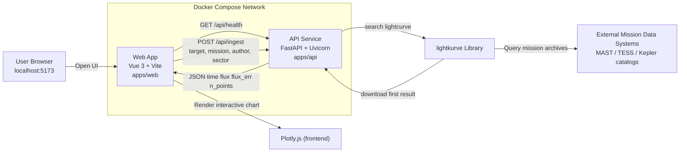

# AstroSignals Architecture

## API Callouts

- `GET /api/health`
  - Purpose: connectivity check from web app.
  - Response: `{ "ok": true }`
- `POST /api/ingest`
  - Input: `{ "target", "mission", "author", "sector" }`
  - Behavior: searches and downloads one light curve via `lightkurve`, cleans NaNs, normalizes flux by median.
  - Response: metadata + arrays (`time`, `flux`, optional `flux_err`).

## External Systems

- `lightkurve` Python package for discovery/download of light curves.
- Mission archives queried through lightkurve (for TESS/Kepler products).
