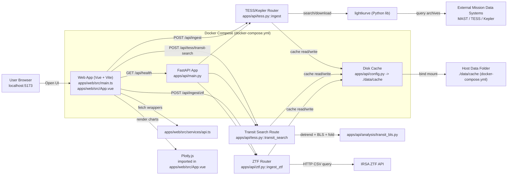

# AstroSignals Architecture

## Code-Level Architecture Map

## Frontend (TypeScript / Vue)

- `apps/web/src/main.ts`
  - Frontend entry point. Mounts the Vue app.
- `apps/web/src/App.vue`
  - Main UI for data-source selection, ingest forms, plotting, and transit candidate display.
  - Calls backend endpoints directly for ingest (`/api/ingest`, `/api/ingest/ztf`) and uses Plotly for chart rendering.
- `apps/web/src/services/api.ts`
  - Typed fetch client for transit search (`POST /api/tess/transit-search`).
  - Defines TS interfaces for transit request/response payloads.
- `apps/web/vite.config.ts`
  - Vite dev server config and `/api` proxy to `VITE_API_BASE_URL`.

Note: `apps/web/src/services/api.js` and `apps/web/src/components/Tooltip.vue.js` exist in the repo, but the source-of-truth frontend code is the TypeScript/Vue files (`.ts`, `.vue`).

## Backend (Python / FastAPI)

- `apps/api/main.py`
  - Creates the FastAPI app.
  - Ensures cache directory exists on startup (`lifespan`).
  - Registers routers from `tess.py` and `ztf.py`.
  - Exposes `GET /api/health`.
- `apps/api/tess.py`
  - Core TESS/Kepler ingest route: `POST /api/ingest` (`ingest(...)`)
  - Transit candidate route: `POST /api/tess/transit-search` (`transit_search(...)`)
  - Input validation/normalization (`IngestRequest`, `TransitSearchRequest`, `normalize_payload`)
  - Light curve extraction + preprocessing (`extract_lightcurve_arrays`)
  - Cache read/write helpers for FITS and JSON responses
- `apps/api/ztf.py`
  - ZTF ingest route: `POST /api/ingest/ztf` (`ingest_ztf(...)`)
  - IRSA ZTF HTTP query, CSV parsing, filtering, and cache persistence
- `apps/api/analysis/transit_bls.py`
  - Transit-search analysis utilities used by `tess.py`
  - Detrending (`detrend_flux`)
  - BLS search (`run_bls`)
  - Phase folding and binning (`phase_fold`, `bin_folded_curve`)
- `apps/api/cache_utils.py`
  - Stable cache-key generation from normalized request payloads (`build_cache_key`)
- `apps/api/config.py`
  - Defines `CACHE_DIR` (`./data/cache`)

## API Callouts (Endpoint -> File -> Behavior)

- `GET /api/health`
  - File: `apps/api/main.py`
  - Purpose: connectivity check from web app.
  - Response: `{ "ok": true }`
- `POST /api/ingest`
  - File: `apps/api/tess.py` (`ingest`)
  - Input: `{ "target", "mission", "author", "sector" }`
  - Behavior:
    - normalizes/validates request payload
    - checks cache (`./data/cache`)
    - searches/downloads one light curve via `lightkurve`
    - extracts arrays and applies finite/quality filtering + median normalization
  - Response: metadata + arrays (`time`, `flux`, optional `flux_err`).
- `POST /api/tess/transit-search`
  - File: `apps/api/tess.py` (`transit_search`)
  - Behavior:
    - reuses ingest pipeline to get normalized TESS/Kepler arrays
    - detrends flux and runs BLS transit search via `apps/api/analysis/transit_bls.py`
    - returns candidate summary + folded curve + diagnostics
- `POST /api/ingest/ztf`
  - File: `apps/api/ztf.py` (`ingest_ztf`)
  - Behavior:
    - validates objectId or RA/Dec request
    - fetches ZTF light curves from IRSA API
    - parses CSV, filters points, selects source, returns JSON arrays

## External Systems

- `lightkurve` Python package (used in `apps/api/tess.py`) for discovery/download of TESS/Kepler light curves.
- Mission archives queried through `lightkurve` (TESS/Kepler products).
- IRSA ZTF light curve API (used in `apps/api/ztf.py`).

## Cache Storage

- Cache path configured in code: `apps/api/config.py` -> `CACHE_DIR = ./data/cache`
- Cache keys generated in: `apps/api/cache_utils.py`
- API cache path in container (Docker): `/app/data/cache`
- Host bind mount configured in: `docker-compose.yml` (`./data:/app/data`)
- Effective host cache directory: `./data/cache`

## Suggested Reading Order (Fastest Way To Understand The App)

- `apps/web/src/App.vue` (what the user can do and what endpoints are called)
- `apps/api/main.py` (how FastAPI is assembled)
- `apps/api/tess.py` (main TESS/Kepler ingest + transit-search flow)
- `apps/api/analysis/transit_bls.py` (transit detection algorithm details)
- `apps/api/ztf.py` (separate ZTF ingestion path)
- `apps/web/src/services/api.ts` and `apps/web/vite.config.ts` (frontend API wiring)
